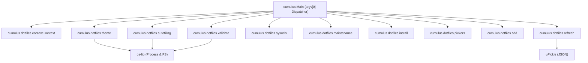

# Architecture Spine — cumulus.dotfiles Scala Migration

## Design Paradigm

Multi-Call CLI Dispatch (Single Executable Subprocess Routing). All domain logic, shell invocations, desktop helpers, and sub-commands live within a single compiled GraalVM native binary (`cumulus`). Sub-command aliases (`cumulus-autotiling`, `cumulus-theme`, `cumulus-sdd`, `cumulus-refresh`, etc.) are implemented as filesystem symlinks pointing to `cumulus`. The main entrypoint inspects `argv(0)` or `argv(1)` and dispatches execution to the target Scala module.

## Invariants & Rules

### AD-1 — Single Multi-Call Native Binary Target [ADOPTED]

- **Binds:** build pipeline, packaging, deployment scripts
- **Prevents:** Creating 24 individual `sbt-native-image` compilation targets, which would multiply GraalVM compilation times (40+ mins total build time) and duplicate Substrate VM runtime overhead.
- **Rule:** All desktop tools (`theme`, `autotiling`, `sdd`, `refresh`, `validate`, `install-*`, `pickers`, `sysutils`, `maintenance`) must be built inside a single sbt project producing a single GraalVM Native Image binary named `cumulus`. All command aliases (`cumulus-<subcommand>`) must be implemented via file system symlinks pointing to `cumulus`.

### AD-2 — Non-Reflective JSON & System I/O Abstractions [ADOPTED]

- **Binds:** serialization, filesystem access, subprocess execution
- **Prevents:** Heavy JVM frameworks (Jackson, Akka, Circe macro reflections) that break GraalVM Native Image AOT compilation or require extensive `reflect-config.json` setup.
- **Rule:** File I/O and process execution MUST use `os-lib` (`com.lihaoyi %% os-lib`). JSON serialization MUST use `uPickle` (`com.lihaoyi %% upickle`) static derive macros (`ReadWriter`), ensuring zero runtime reflection dependencies for native compilation.

### AD-3 — Pure Command-Line Argument Parsing Strategy [ADOPTED]

- **Binds:** CLI entrypoints and sub-command routing
- **Prevents:** Mismatched flag signatures across symlinked aliases vs umbrella command invocations.
- **Rule:** `cumulus.Main` MUST inspect `argv(0)` to detect `cumulus-<cmd>` symlink execution and strip the `cumulus-` prefix, or inspect `argv(1)` when executed as `cumulus <cmd>`. Sub-command flag parsing must use type-safe `mainargs` annotations or pattern-matched parameter vectors.

### AD-4 — Direct Process Stream Handling & Zero Heap Bloat [ADOPTED]

- **Binds:** Sway IPC, wofi GUI pickers, swaylock calls, system status queries
- **Prevents:** Excessive JVM heap allocations during background event loop triggers (e.g. Sway window focus changes).
- **Rule:** Subprocess calls to external tools (`swaymsg`, `wofi`, `kitty`, `swaylock`, `pactl`) must stream stdout/stderr using `os.proc(...).call()` or `os.proc(...).spawn()`, explicitly avoiding intermediate memory buffering for binary/image streams.

## Consistency Conventions

| Concern | Convention |
| --- | --- |
| Naming | Namespace modules under `cumulus.dotfiles.<module>` (e.g. `cumulus.dotfiles.autotiling`) |
| Data & Formats | Standardize JSON configs using `uPickle` derived case classes with camelCase fields |
| Error Handling | Use sealed `CumulusError` traits returning `Either[CumulusError, Unit]` with CLI exit codes (0 for success, non-zero for failure) |
| Configuration & Paths | Resolve XDG directory defaults (`~/.config`, `~/.local/share`) via `os.Path` and environment variables |

## Stack

| Name | Version |
| --- | --- |
| Scala | 3.5.2 |
| JDK (GraalVM Community) | 21.0.2 |
| sbt | 1.10.2 |
| sbt-native-image | 0.5.0 |
| os-lib | 0.11.9-M8 |
| uPickle | 4.4.3 |
| mainargs | 0.7.0 |

## Structural Seed



```text
cumulus.dotfiles/
  build.sbt                        # sbt build definition with sbt-native-image
  project/
    plugins.sbt                    # addSbtPlugin("io.github.davidgregory084" % "sbt-native-image" % "0.5.0")
  src/
    main/
      scala/
        cumulus/
          Main.scala               # Multi-call binary entrypoint (main method)
          dotfiles/
            context/Context.scala  # XDG & Sway environment discovery
            error/CumulusError.scala # Error domain definitions
            autotiling/Autotiling.scala
            theme/ThemeEngine.scala
            refresh/RefreshEngine.scala
            sysutils/SysUtils.scala
            maintenance/Maintenance.scala
            install/Installers.scala
            pickers/WofiPickers.scala
            sdd/SpecDrivenDev.scala
            validate/Validator.scala
```

## Capability → Architecture Map

| Capability / Area | Lives in | Governed by |
| --- | --- | --- |
| Binary Dispatch & Routing | `cumulus.Main` | AD-1, AD-3 |
| Sway Autotiling Engine | `cumulus.dotfiles.autotiling` | AD-1, AD-4 |
| Theme & Wallpaper Engine | `cumulus.dotfiles.theme` | AD-1, AD-2 |
| System Refresh & Notifications | `cumulus.dotfiles.refresh` | AD-2, AD-4 |
| SDD AI Context Generator | `cumulus.dotfiles.sdd` | AD-2 |
| Package & Tool Installers | `cumulus.dotfiles.install` | AD-2, AD-4 |

## Deferred

- **Effect System Selection**: Whether to introduce Cats Effect or ZIO or keep imperative `os-lib` calls is deferred to individual story implementation (imperative `os-lib` recommended for native binary footprint).
- **GraalVM Garbage Collector**: Serial GC (default for Native Image) is adopted; G1GC optimization is deferred until performance profiling.
