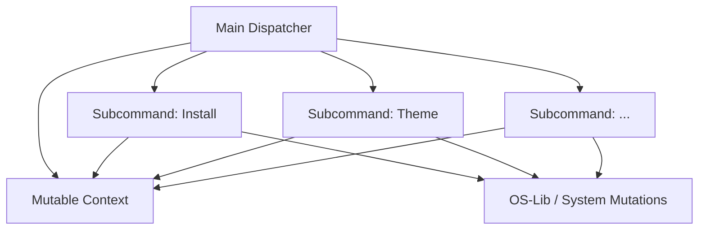

# Architecture Spine — cumulus.dotfiles

## Design Paradigm

**Native Monolithic CLI Orchestrator**
The system is built as a single, cohesive Scala 3 application compiled ahead-of-time to a GraalVM Native Image. It acts as a centralized orchestrator (`cumulus`) that parses inputs and dispatches execution to isolated subcommands. Each subcommand operates independently but shares a unified execution context.

## Invariants & Rules

### AD-1 — Direct Inline Side-Effects [ADOPTED]
- **Binds:** All subcommand modules
- **Prevents:** Over-engineering through complex abstraction layers (IoC/DI) for system mutations.
- **Rule:** Modules may directly execute side-effects (e.g., `os.proc(...).call()`, `os.write(...)`) inline. No strict `--dry-run` or mockable interface boundaries are required.

### AD-2 — Mutable Context Registry
- **Binds:** `cumulus.dotfiles.context.Context` and all modules
- **Prevents:** Cumbersome functional state-passing between discrete stages of a subcommand.
- **Rule:** The `Context` object serves as a mutable registry. Modules are permitted to update and retrieve state from it during a single execution run.

### AD-3 — Fail-Fast Error Contract
- **Binds:** All subcommand execution paths
- **Prevents:** Unpredictable automatic rollback attempts that could further corrupt the desktop environment.
- **Rule:** Subcommands must fail-fast. Upon encountering a failure, they must halt immediately, return a `CumulusError`, and leave the system in its current state for manual user remediation.

### AD-4 — Zero-Dependency Native Distribution [ADOPTED]
- **Binds:** CI/CD and deployment pipeline
- **Prevents:** Requiring users to install JVMs or Scala build tools just to apply their dotfiles.
- **Rule:** The CLI must be distributed exclusively as a self-contained GraalVM native image via Maven Central and GitHub Releases.



## Consistency Conventions

| Concern | Convention |
| --- | --- |
| Error shapes | All domain errors extend `CumulusError` and are returned via `Either[CumulusError, A]`. |
| Cross-cutting config | Handled exclusively via the `Context` object parsed at process start. |
| External process calls | Executed via `os-lib` (`os.proc`). |

## Stack

| Name | Version |
| --- | --- |
| Scala | 3.5.2 |
| GraalVM JDK | 21 |
| os-lib | 0.11.9-M8 |
| mainargs | 0.7.0 |
| upickle | 4.4.3 |

## Structural Seed

```text
cumulus.dotfiles/
  src/main/scala/cumulus/
    Main.scala                 # Orchestrator & Dispatcher
    dotfiles/
      context/                 # Mutable Context Registry
      error/                   # CumulusError definitions
      install/                 # Bootstrapping logic
      theme/                   # Theme application
      ...                      # Other subcommand domains
  config/                      # Sway/Waybar/Wofi configurations (Symlink targets)
  zsh/                         # ZSH configurations
```

## Deferred

- **Sub-theme logic structures:** How individual themes (AWS, Azure, GCP) are defined and structured is deferred to the specific `theme` module implementation, as long as it adheres to the fail-fast and direct-mutation rules.
- **Test Automation Strategy:** Specific unit testing boundaries are deferred since side-effects are inline. Integration/End-to-End testing strategies will be defined later.
