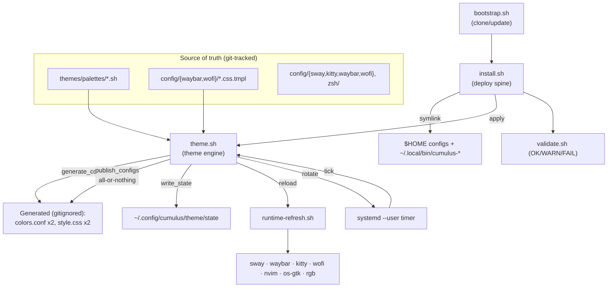

> **Template note:** The requested standard `docs/spec_template.md` does **not**
> exist in the repository (only BMAD skill templates under `.agents/skills/…`).
> This document follows the section structure defined in the generation request,
> which supersedes the missing file. Facts are cited to source; inferences are
> marked **[ASSUMPTION]**.

---

## 1. Executive Summary

`cumulus.dotfiles` is a personal, reproducible **Sway/Wayland desktop
configuration** for Ubuntu/Debian and Arch Linux. It converts a fresh machine
into a fully-themed cloud-branded desktop (AWS/Azure/GCP/OCI palettes) in one
or two commands. It is not an application — it is a **symlink-based
configuration system** in which the git repository *is* the source of truth:
configs are symlinked into `$HOME`, never copied.

Two spines define the system: a **deployment spine** (`install.sh`) that
symlinks configs and scripts and installs packages/tools idempotently, and a
**theme engine** (`scripts/theme.sh`) that renders palette + template sources
into generated app configs, publishes them atomically, persists state, and
live-reloads running apps.

This spec is **descriptive/as-built** — the system is fully implemented and
in use. No new work is proposed here.

---

## 2. Analysis Phase (Evidence)

### 2.1 Business Context
- **Problem solved:** Reproducible, versioned, cross-distro desktop setup that
  is safe to re-run and easy to re-theme, without hand-copying dotfiles or
  losing existing files. Source: `README.md`, `install.sh` header.
- **Users:** Single power-user/developer ("Petrolal") on enterprise/dev
  workstations (AD/LDAP/SSSD-aware account handling). Source:
  `.github/copilot-instructions.md` (rule 8), `config/sway/config` header.
- **Value:** One-command bootstrap on any new machine; consistent theming
  across sway/waybar/wofi/kitty/nvim/RGB.

### 2.2 Existing Architecture
- Symlink model: `install.sh` `LINKS` map + `link_one()` / `link_scripts()`.
- Theme pipeline: `scripts/theme.sh` (`generate_configs` → `publish_configs`
  → `write_state` → `reload_apps`) + `scripts/runtime-refresh.sh`.
- Palettes/templates: `themes/palettes/*.sh`, `config/{waybar,wofi}/*.css.tmpl`.
- Validation: `scripts/validate.sh` (OK/WARN/FAIL).
- Remote bootstrap: `bootstrap.sh`.

### 2.3 Inspected Artifacts
| Artifact | Present? | Source |
|---|---|---|
| README | Yes | `README.md` |
| docs folder | Partial | `docs/architecture.md` (added), `docs/spec_template.md` **missing** |
| Existing specs | No | none under `docs/specs/` before this file |
| ADRs | No | Not identified during repository analysis |
| API definitions | CLI only | `theme.sh`, `install.sh`, `cumulus-*` |
| Database models | N/A | file-based state only (`theme/state`) |
| CI/CD | **None** | `.github/` holds only BMAD agent defs; no `.github/workflows/` |
| Infra files | systemd user units | generated by `theme.sh` `write_rotate_units` |
| Env config | Env overrides | `bootstrap.sh` (`CUMULUS_REPO/DIR/REF`), `runtime-refresh.sh` (`CUMULUS_KITTY_SOCKET`) |
| Tests | Yes (no framework) | `tests/*.sh` |
| Source | Bash + 1 Python | `scripts/`, `config/`, `zsh/` |

### 2.4 Technical Constraints
- Bash `set -euo pipefail` default; documented exceptions
  (`validate.sh` = `-uo`, `install-sdkman.sh` = no `-u`). Source:
  `.github/copilot-instructions.md`, script headers.
- GTK CSS `@import` unusable → `sed` placeholder rendering required.
- Scripts run via `cumulus-*` symlinks → must `readlink -f` before deriving
  `DOTFILES_DIR`.
- apt-before-pacman detection; AUR via yay→paru only.

---

## 3. Requirements

### 3.1 Functional Requirements

| ID | Requirement | Source |
|---|---|---|
| FR-1 | Deploy configs into `$HOME` as symlinks back to the repo | `install.sh` `LINKS`, `link_one()` |
| FR-2 | Back up any pre-existing real file/dir to `~/.cumulus_backup/<ts>/` before linking; never delete | `install.sh` `link_one()` |
| FR-3 | Be idempotent — re-running skips already-correct links | `install.sh` `link_one()`/`link_scripts()` |
| FR-4 | Expose every `scripts/*.{sh,py}` as `~/.local/bin/cumulus-<name>` | `install.sh` `link_scripts()` |
| FR-5 | Install required desktop packages via apt or pacman(+AUR) | `install.sh` `install_packages()` |
| FR-6 | Support flags: `--links-only/--no-packages/--no-nvim/--no-sdkman/--zsh/--apps/--devops/--browser/--all-tools/--dry-run/--no-validate` | `install.sh` arg parser |
| FR-7 | Render palette+template into 4 generated app configs | `theme.sh` `generate_configs()` |
| FR-8 | Publish generated configs all-or-nothing with rollback | `theme.sh` `publish_configs()` |
| FR-9 | Persist theme state atomically; reject embedded newlines | `theme.sh` `write_state()` |
| FR-10 | `theme.sh set` supports flat / wallpaper / theme-default / rotate / preserve-background | `theme.sh` `cmd_set()` |
| FR-11 | `theme.sh apply` re-applies saved state, self-healing invalid/missing values | `theme.sh` `cmd_apply()` |
| FR-12 | `theme.sh next` advances rotation to next wallpaper | `theme.sh` `cmd_next()` |
| FR-13 | `theme.sh list/current` report flavors, wallpapers, active state | `theme.sh` `cmd_list()/cmd_current()` |
| FR-14 | Rotate mode driven by a `systemd --user` timer; disabled on non-rotate modes | `theme.sh` `write_rotate_units()/disable_rotate_units()` |
| FR-15 | Live-reload running apps after theme change (best-effort adapters) | `runtime-refresh.sh` |
| FR-16 | Kill prior `swaybg` before spawning new (prevent process leak) | `theme.sh` `generate_configs()` sway block |
| FR-17 | Remote one-liner bootstrap: clone/update repo then exec `install.sh` | `bootstrap.sh` |
| FR-18 | Read-only health check with OK/WARN/FAIL, non-zero exit on FAIL | `validate.sh` |
| FR-19 | Backup/restore of managed `$HOME` files as tarballs | `backup.sh`, `restore.sh` |
| FR-20 | Update workflow: `git pull --ff-only` + re-install, refusing on dirty tree | `update.sh` |
| FR-21 | Auto-discover flavors from `themes/palettes/*.sh` | `theme.sh` `valid_flavors()` |
| FR-22 | Auto-source `zsh_config/*.zsh` in numeric order (SDKMAN last) | `zsh/.zshrc`, `README.md` |
| FR-23 | GUI theme picker front-end (wofi) calling `theme.sh set` | `config/sway/scripts/theme-picker.sh` |
| FR-24 | Which-key cheatsheet parsing live sway config | `config/sway/scripts/whichkey.sh` |

### 3.2 Non-Functional Requirements

| ID | Category | Requirement | Source |
|---|---|---|---|
| NFR-1 | Reliability | All-or-nothing config publish with rollback on any failure | `theme.sh` `publish_configs()` |
| NFR-2 | Reliability | Idempotent, safe-to-rerun installers | `install.sh`, `.github/copilot-instructions.md` |
| NFR-3 | Data safety | Atomic state writes (mktemp+`mv -f`), newline rejection, `chmod 600` | `theme.sh` `write_state()` |
| NFR-4 | Data safety | No destructive deletes; backups before overwrite | `install.sh`, `restore.sh` |
| NFR-5 | Security | Refuse to run bootstrap as root; scripts avoid privileged copies | `bootstrap.sh` |
| NFR-6 | Security | Runtime adapters verify socket ownership before use | `runtime-refresh.sh` `refresh_kitty/refresh_nvim_socket` |
| NFR-7 | Portability | Support apt + pacman/AUR; unpinned upstream versions | `install.sh`, `.github/copilot-instructions.md` |
| NFR-8 | Maintainability | Palette contract validated in code + tests (single source of truth) | `theme.sh` `validate_palette()`, `tests/palettes.sh` |
| NFR-9 | Observability | Per-script colored `[name]` logging; validate.sh summary | all scripts |
| NFR-10 | Performance | `swaybg` reaped each tick to bound process count | `theme.sh` comment ("50+ observed") |
| NFR-11 | Resilience | Adapters best-effort; persisted state authoritative when app absent | `runtime-refresh.sh` header |
| NFR-12 | Usability | `--dry-run` previews with zero side effects end-to-end | `install.sh`, installers |

### 3.3 Business Rules

| ID | Rule | Source |
|---|---|---|
| BR-1 | Repo files are the source of truth; deploy via symlink only, never copy into `$HOME` | `install.sh`, `.github/copilot-instructions.md` |
| BR-2 | Generated configs are derived artifacts — never hand-edit; edit palette/template then `theme.sh apply` | `.gitignore`, `theme.sh`, `.github/copilot-instructions.md` |
| BR-3 | Each palette must define `THEME_NAME`(=filename), `THEME_LABEL`, `NVIM_COLORSCHEME`, and 24 `#rrggbb` vars | `theme.sh` `validate_palette()` |
| BR-4 | Any palette-var change must update 3 places together: `validate_palette()`, `tests/palettes.sh`, all 4 palettes | `.github/copilot-instructions.md`, `tests/palettes.sh` |
| BR-5 | Default flavor `oci`, default mode `rotate` when no state exists | `theme.sh` `cmd_apply()` |
| BR-6 | Theme state written only through `write_state()` (atomic, newline-validated) | `theme.sh` |
| BR-7 | Wallpaper pool = files matching `themes/wallpapers/<flavor>(.|_|-)*`; falls back to all images | `theme.sh` `get_flavor_wallpapers_array()` |
| BR-8 | Interval must match `^[1-9][0-9]*(ms|us|s|m|h|d|w)$` | `theme.sh` `validate_interval()` |
| BR-9 | `wallpaper_source` must be valid for its mode (flat:flat, wallpaper:user|theme-default, rotate:rotate) | `theme.sh` `validate_wallpaper_source()` |
| BR-10 | Installers detect apt before pacman; AUR via yay then paru; warn if neither | `install.sh`, `.github/copilot-instructions.md` |
| BR-11 | Account ops try normal → NSS-aware sudo → warn (AD/LDAP/SSSD) | `.github/copilot-instructions.md` (rule 8) |
| BR-12 | `update.sh` refuses to run with uncommitted local changes | `update.sh`, `README.md` |
| BR-13 | bootstrap must not run as root | `bootstrap.sh` |
| BR-14 | Waybar/wofi rendered via `sed @@PLACEHOLDER@@`, never GTK `@import` | `theme.sh`, `.github/copilot-instructions.md` |
| BR-15 | Do not reference legacy Catppuccin flavor names in new code | `.github/copilot-instructions.md` |

---

## 4. Design

### 4.1 Architecture Overview



### 4.2 Component Impact Analysis
Descriptive spec — no changes proposed.
- **New components:** None. This spec itself + `docs/architecture.md` are the
  only additions.
- **Modified components:** None.
- **Removed components:** None.

### 4.3 Data Flow — `cumulus-theme set <flavor> --rotate`

```mermaid
sequenceDiagram
    actor User
    participant TS as theme.sh (cmd_set)
    participant PAL as palette + templates
    participant PUB as publish_configs
    participant ST as theme/state
    participant SYSD as systemd --user
    participant RR as runtime-refresh.sh
    participant APPS as sway/waybar/kitty/…

    User->>TS: set flavor --rotate --interval 30m
    TS->>TS: is_valid_flavor / validate_interval
    TS->>PAL: source palette; validate_palette
    TS->>TS: generate_configs (render to tmp dir)
    TS->>PUB: publish (backup→move, rollback on fail)
    TS->>ST: write_state (atomic, newline-checked)
    TS->>SYSD: write+enable rotate timer
    TS->>RR: reload_apps
    RR->>APPS: sway reload / SIGUSR2 waybar / kitty set-colors / …
    RR-->>User: partial|complete refresh summary
```

---

## 5. Technical Specification

### 5.1 "API" (CLI) Surface
- **`cumulus-theme`** (`theme.sh`): `set <flavor> [--flat | --wallpaper <path|name> | --theme-default | --rotate [--interval N] | --preserve-background]`, `apply`, `next`, `list`, `current`. Validation: flavor regex `^[A-Za-z0-9_-]+$` + palette file existence; interval regex (BR-8); mode/source matrix (BR-9). Auth: none (user-scoped).
- **`install.sh`**: flags per FR-6; `--dry-run` forwarded to installers.
- **`bootstrap.sh`**: forwards all args to `install.sh`; env `CUMULUS_REPO/DIR/REF`.
- **`cumulus-*`**: `update, validate, backup, restore, screenshot, lock, idle, os-colorscheme, rgb-theme, runtime-refresh, install-*`.
- **Contracts:** exit non-zero on FAIL (`validate.sh`), on dirty tree (`update.sh`), on invalid palette/interval/source (`theme.sh` `die`).

### 5.2 Database Changes
Not applicable — no database. Persistent state is a flat file
`~/.config/cumulus/theme/state` with keys
`FLAVOR, MODE, WALLPAPER, WALLPAPER_SOURCE, INTERVAL, NVIM_COLORSCHEME`
(`theme.sh` `write_state()/load_state()`). No migrations, tables, or indexes.

### 5.3 Configuration Changes
- **Env vars:** `CUMULUS_REPO`, `CUMULUS_DIR`, `CUMULUS_REF` (`bootstrap.sh`);
  `CUMULUS_KITTY_SOCKET` (`runtime-refresh.sh`); `JAVA_VERSION`
  (`install-sdkman.sh`, non-interactive); `KEEP_ZSHRC=yes` (`install-zsh.sh`).
- **Feature flags:** None (behavior via CLI flags).
- **Runtime config:** systemd `--user` units
  `cumulus-wallpaper-rotate.{service,timer}` generated on rotate mode.

---

## 6. Testing Strategy

No test framework — each `tests/*.sh` is a standalone executable
(`set -euo pipefail`, sandboxed `$HOME`, non-zero on first `FAIL`).

### 6.1 Unit / Contract Scenarios
| Scenario | Expected | Coverage |
|---|---|---|
| Every palette defines all 24 vars + valid metadata | pass; else `FAIL` | `tests/palettes.sh` |
| `theme.sh list` shows all flavors | contains aws/azure/gcp/oci | `tests/palettes.sh` |
| Rendering produces valid app configs from palette | placeholders substituted | `tests/theme-rendering.sh` |
| Wallpaper pool resolution honors flavor prefix + fallback | correct set selected | `tests/theme-wallpapers.sh` |
| State write rejects newlines; tolerates missing file; systemctl stubbed | safe atomic write | `tests/state-safety.sh` |

### 6.2 Integration Scenarios
| Scenario | Expected | Coverage |
|---|---|---|
| Runtime adapters degrade gracefully when app absent | "deferred", state authoritative | `tests/runtime-refresh.sh` |
| Theme picker calls `theme.sh set` with correct args | correct invocation | `tests/theme-picker.sh` |
| nvim installer dirty-checkout behavior | expected message/exit | `tests/install-nvim.sh` |

### 6.3 End-to-End Scenarios
| Scenario | Expected |
|---|---|
| Fresh install dry-run all tools | `./install.sh --dry-run --all-tools` prints planned actions, no changes |
| `set oci --rotate` then reboot/login `apply` | same flavor/mode restored; timer active |
| Switch rotate→flat | timer disabled; flat color background |

### 6.4 Manual Validation
- `bash -n <changed-script>`; `sway --validate -c "$HOME/.config/sway/config"`;
  `cumulus-validate`; visual reload via `swaymsg reload`.

### 6.5 Acceptance Criteria (measurable)
- **AC-1:** After `install.sh`, `cumulus-validate` exits 0 with no FAIL lines
  on a supported, fully-installed machine.
- **AC-2:** Given no state file, `theme.sh apply` produces `FLAVOR=oci`,
  `MODE=rotate` in `theme/state`.
- **AC-3:** A `publish_configs` failure leaves all 4 destination files at their
  pre-run content (rollback verified).
- **AC-4:** `write_state` with a value containing `\n` exits non-zero and does
  not modify `theme/state`.
- **AC-5:** Re-running `install.sh` on an already-linked machine performs zero
  new symlink creations (all "OK already linked").
- **AC-6:** After a rotate `set`, exactly one `swaybg` process is running.

---

## 7. Risk Analysis

| ID | Type | Risk | Mitigation |
|---|---|---|---|
| R-1 | Operational | No CI — regressions caught only by manual tests | **[ASSUMPTION]** Add GitHub Actions running `tests/*.sh` + `bash -n`; documented gap in `.github/copilot-instructions.md` |
| R-2 | Technical | Palette var drift across 3 files breaks rendering opaquely | BR-4 enforced by `tests/palettes.sh`; keep in one commit |
| R-3 | Operational | `swaybg` process leak on rotation | Mitigated: `pkill -x swaybg` each tick (FR-16) |
| R-4 | Security | Remote `curl | bash` bootstrap executes upstream code | Refuses root (BR-13); pinnable via `CUMULUS_REF`; user must trust repo |
| R-5 | Security | Runtime adapters send commands to sockets | Ownership check before use (NFR-6) |
| R-6 | Operational | Non-symlinked real file blocks clean deploy | Auto-backup before link (FR-2); `validate.sh` flags it |
| R-7 | Business | Unpinned upstream versions may break setup over time | Accepted trade-off (`.github/copilot-instructions.md`); validate.sh surfaces breakage |
| R-8 | Technical | AD/LDAP/SSSD account edits may fail | try→sudo→warn fallback (BR-11) |
| R-9 | Operational | Stale docs referencing deleted `docs/*` paths | Noted in `.github/copilot-instructions.md`; this spec + `docs/architecture.md` restore current docs |

---

## 8. Deployment Considerations

- **Rollout strategy:** Per-machine, user-initiated. New machine →
  `bootstrap.sh`; existing → `cumulus-update`. Idempotent; safe to re-run.
- **Monitoring:** `cumulus-validate` (manual/cron `--quiet`); systemd
  `systemctl --user status cumulus-wallpaper-rotate.timer`.
- **Logging:** Per-script ANSI `[name]` stdout logging; `runtime-refresh.sh`
  prints per-adapter refreshed/deferred + summary. No central log store.
- **Rollback:** (a) Configs — `publish_configs` auto-rollback on failure;
  (b) `$HOME` files — `~/.cumulus_backup/<ts>/` + `cumulus-restore`;
  (c) Repo — `git` revert + re-run `install.sh`; (d) Rotation — switch to
  flat/wallpaper disables the timer.

---

## 9. Lifecycle Placement

`docs/specs/completed` — the described system is **fully implemented and in
active use**; this is an as-built specification, not planned work.

---

## 10. Confidence, Assumptions & Open Items

**Confidence level: High** — grounded directly in source (`install.sh`,
`theme.sh`, `runtime-refresh.sh`, `validate.sh`, `bootstrap.sh`, `tests/*`,
`.github/copilot-instructions.md`, `README.md`).

**Key assumptions (marked [ASSUMPTION]):**
- Single-user personal project; no multi-tenant/teams requirement.
- CI absence is a known gap, not a deliberate non-goal (R-1).
- "API" = CLI surface; there is no network/service API.

**Missing information requiring stakeholder validation:**
- `docs/spec_template.md` does not exist — confirm the intended standard
  (this doc used the request's structure).
- No ADRs found — confirm none are expected. *(Not identified during
  repository analysis.)*
- Whether CI (GitHub Actions) should be introduced to run `tests/*.sh`.
- Intended long-term policy for the deleted `docs/` narrative files.
